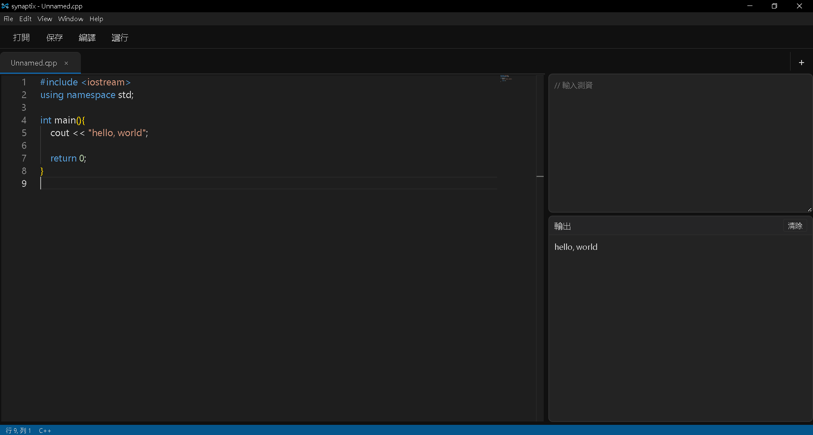

# synaptix

- [English](README.md)
- [中文](README_zh.md)

### Introduction
synaptix, a code editor for competitive problem solving (currently: C++)
Like most online judges
Directly test stdin and output the results to stdout

It comes with [winlibs](https://winlibs.com/) and does not require external installation of C++

### Download
Download `synaptix\pack\win-unpacked`
There is a free installation file

### Update Direction
* Support Terminal
* Support more languages
* Modify interface and functions
* Measure CPU time, memory
* Added built-in theme library

### Give me some suggestions
cracker04012008@gmail.com
