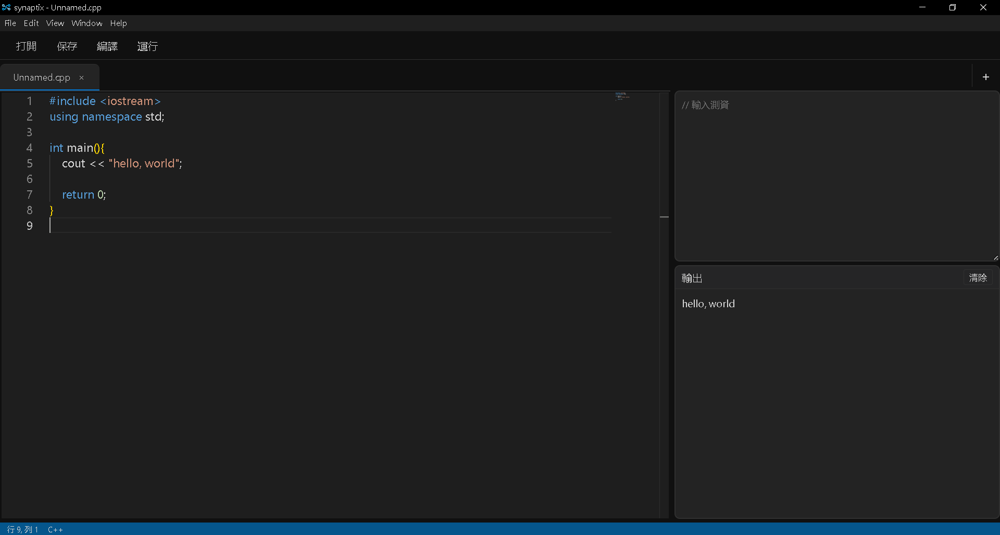

# synaptix

- [English](README.md)
- [中文](README_zh.md)

### 簡介
synaptix，競程解題用的代碼編輯器 (目前: C++)\
跟大多數 Online Judge 一樣\
直接 stdin 測資然後將結果輸出到 stdout\
(~~Debug 要一直輸測資好麻煩~~)

- 本身攜帶 [winlibs](https://winlibs.com/) 不用而外安裝 C++

### 下載
`synaptix\pack\win-unpacked`\
裡頭有免安裝檔

### 之後預計的更新方向 (前提是我有空)
* 支援終端
* 支援更多語言
* 修改介面，新增功能
* 測量 CPU 時間、記憶體
* 增加內建題庫

### 給我點建議 (~~雖然我不會看~~)
cracker04012008@gmail.com
